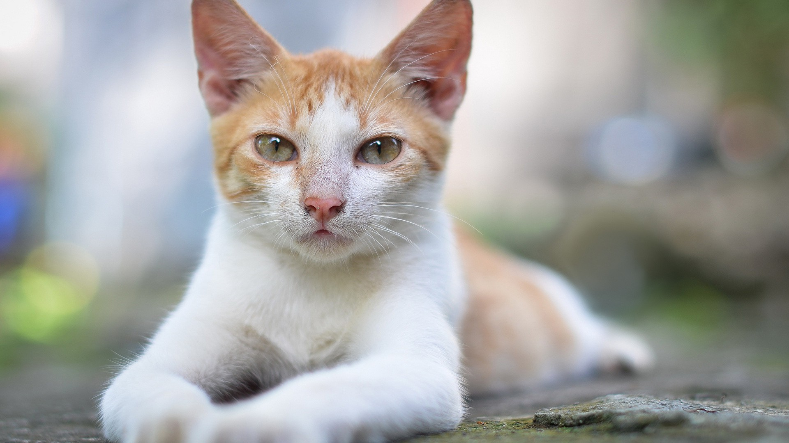

# 🐱 Cat vs. Dog Classifier 🐶

This project is a **Convolutional Neural Network (CNN)** model that can distinguish between **cats** and **dogs** in images. Inspired by tutorials and articles, such as [Cat & Dog Classification Neural Network in Python](https://www.geeksforgeeks.org/deep-learning/cat-dog-classification-using-convolutional-neural-network-in-python/), this project was designed as an introduction to using AI models with Python.

Ultimately, the goal was to familiarize myself with building, training, and deploying AI models—starting with a simple binary classification task: Cats vs. Dogs.

_Is it cat? Is it dog? Or is it something in between?_

---

## 🚀 Features

- **CNN**: A straightforward Convolutional Neural Network which knows the difference between a dog and a cat.
- **Image Preprocessing**: Resizing, normalization, and batching for preparing image data.
- **Model Evaluation**: Track performance during training, including accuracy and loss metrics.
- **Saving & Loading**: The trained model can be saved and reloaded for future predictions.

# Cat vs Dog Model Results

If you for some reason have never seen a cat or dog before or struggle to tell the difference this is a helpful tool to help you figure out what it is.


# 🚨 CAT SPOTTED! 🚨


# 🚨 DOG SPOTTED! 🚨

---

## 💻 Getting Started

To get started with this project, follow these steps:

### 1. Clone the Repository

```bash
git clone https://github.com/yourusername/cat-vs-dog-classifier.git
cd cat-vs-dog-classifier
```

### 2. Create a Virtual Environment

```bash
python -m venv venv
source venv/bin/activate # On Window, use `venv/Scripts/activate`
```

### 3. Install Dependencies
```bash
pip install -r requirements.txt
```

# 📸 Using the Model

After setting up the environment and installing dependencies, you can begin using the model. Follow these steps:

## 1. Train The Model

Run `train_model` this will train the model using Tensorflow dataset 

```bash
python train_model.py
```

## 2. Prepare Your Images

Place your cat and dog images the `images` folder
Change the `image_path = 'images/image1.jpg'` to your desired image

## 3. Run the Model

Run the `run_model.py` script and view the results in the terminal

```bash
python run_model.py
```
